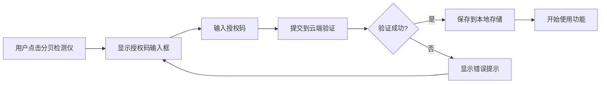

# 🔐 分贝检测仪授权码系统使用指南

## 📖 系统说明

这是一个简单易用的授权码系统，用于保护你的分贝检测仪功能。用户购买后输入授权码即可使用，每个授权码最多支持 **3 台设备**。

---

## 🚀 快速开始（3步配置）

### 第一步：生成授权码

1. 在浏览器中打开 `tools/license-generator.html` 文件
2. 输入要生成的授权码数量（例如：10个）
3. 点击 **"生成授权码"** 按钮
4. 点击 **"下载ENV格式"** 按钮，保存配置文件


**示例授权码：**
```
ABCD-EFGH-JKLM-NPQR
WXYZ-2345-6789-HKMT
```

---

### 第二步：配置 Vercel 环境变量

1. 登录 [Vercel Dashboard](https://vercel.com)
2. 进入你的项目
3. 点击 **Settings** → **Environment Variables**
4. 添加新的环境变量：
   - **Name**: `LICENSE_CODES`
   - **Value**: 复制你生成的所有授权码，用**逗号**分隔
   
   例如：
   ```
   ABCD-EFGH-JKLM-NPQR,WXYZ-2345-6789-HKMT,STUV-WXYZ-ABCD-EFGH
   ```

5. 选择 **Production**、**Preview** 和 **Development** 环境
6. 点击 **Save** 保存
7. **重新部署项目**（Vercel会自动触发）


---

### 第三步：发货给客户

客户购买后，给他们发送：

**【分贝检测仪授权码】**
```
授权码：ABCD-EFGH-JKLM-NPQR

使用方法：
1. 打开网站：https://你的域名.vercel.app
2. 点击"分贝检测仪"功能
3. 输入上方授权码
4. 点击"验证授权码"即可使用

✅ 永久有效，最多可在3台设备使用
✅ 如有问题，请联系客服
```

---

## 💡 工作原理



### 🔒 安全机制

1. **云端验证**：授权码必须与 Vercel 环境变量中的匹配
2. **设备限制**：每个授权码最多绑定 3 台设备
3. **设备指纹**：基于浏览器特征生成唯一设备ID
4. **本地缓存**：验证成功后保存到 localStorage，避免重复验证

### 📱 设备绑定规则

- 同一台设备多次验证 = 只占用 1 个设备名额
- 更换浏览器 = 算作新设备
- 清除浏览器数据后 = 需要重新输入授权码

---

## 📋 常见问题 FAQ

### Q1: 用户说授权码无效怎么办？
**A**: 检查以下几点：
1. 授权码是否添加到 Vercel 环境变量中
2. Vercel 是否已重新部署
3. 授权码格式是否正确（16位字符，带连字符）
4. 是否已超过3台设备限制

### Q2: 如何添加更多授权码？
**A**: 
1. 打开 `tools/license-generator.html` 生成新授权码
2. 在 Vercel 环境变量中，将新授权码用逗号追加到 `LICENSE_CODES` 后面
3. 保存并重新部署

### Q3: 用户换了手机/电脑，授权码还能用吗？
**A**: 可以，每个授权码支持3台设备。如果已满，需要联系你解除绑定或购买新授权码。

### Q4: 如何解除某个设备的绑定？
**A**: 目前需要重新生成授权码。后续可以升级为数据库版本，支持后台管理。

### Q5: 授权码会过期吗？
**A**: 不会，授权码永久有效。

---

## 🎨 用户使用流程

### 步骤1：购买商品
用户在淘宝购买分贝检测仪授权

### 步骤2：收到授权码
你通过旺旺或自动发货发送授权码：
```
ABCD-EFGH-JKLM-NPQR
```

### 步骤3：访问网站并输入授权码
用户打开网站，点击分贝检测仪，输入授权码

### 步骤4：开始使用
验证成功后，立即可以使用所有功能

---

## 🛠️ 高级配置（可选）

### 自定义设备限制数量

修改 `api/verify-license.ts` 文件：

```typescript
licenseDatabase.set(upperCode, {
  code: upperCode,
  deviceLimit: 5, // 改成 5 台设备
  usedDevices: [],
});
```

### 自定义错误提示

修改 `doraemon-monitor/components/LicenseInput.tsx` 文件中的文字内容。

### 修改淘宝购买链接

在 `doraemon-monitor/components/LicenseInput.tsx` 中找到：

```typescript
<a 
  href="https://item.taobao.com/你的商品链接" 
  target="_blank" 
  rel="noopener noreferrer"
  className="license-link"
>
```

替换成你的实际淘宝商品链接。

---

## 📊 数据持久化升级方案（可选）

当前方案使用内存存储，重启后设备绑定数据会丢失。如需永久存储，可以升级为：

### 方案1：Vercel KV（推荐）
- 免费额度：100,000 次读取/月
- 配置简单，官方支持
- [查看文档](https://vercel.com/docs/storage/vercel-kv)

### 方案2：MongoDB Atlas
- 免费512MB存储
- 功能强大，适合扩展
- [查看文档](https://www.mongodb.com/cloud/atlas)

### 方案3：Supabase
- 免费500MB数据库
- 带管理后台
- [查看文档](https://supabase.com)

---

## 🎯 核心文件说明

| 文件路径 | 作用 |
|---------|------|
| `tools/license-generator.html` | 授权码生成工具（你用） |
| `api/verify-license.ts` | 云端验证API |
| `doraemon-monitor/components/LicenseInput.tsx` | 授权码输入界面 |
| `doraemon-monitor/utils/licenseManager.ts` | 授权码管理工具函数 |
| `doraemon-monitor/DoraemonMonitorApp.tsx` | 集成了授权验证的主应用 |

---

## ✅ 测试清单

部署后测试：

- [ ] 打开网站，点击分贝检测仪
- [ ] 输入错误授权码，应显示"授权码无效"
- [ ] 输入正确授权码，应验证成功并进入功能
- [ ] 刷新页面，应直接进入功能（无需再次输入）
- [ ] 在第2台设备测试，应该可以正常使用
- [ ] 在第4台设备测试，应显示"已达到设备限制"

---

## 📞 技术支持

如有问题，请检查：
1. Vercel 部署日志
2. 浏览器控制台错误信息
3. 环境变量配置是否正确

---

## 🎉 开始使用

现在你可以：
1. 打开 `tools/license-generator.html` 生成授权码
2. 配置 Vercel 环境变量
3. 部署项目
4. 开始销售！

祝生意兴隆！🚀

