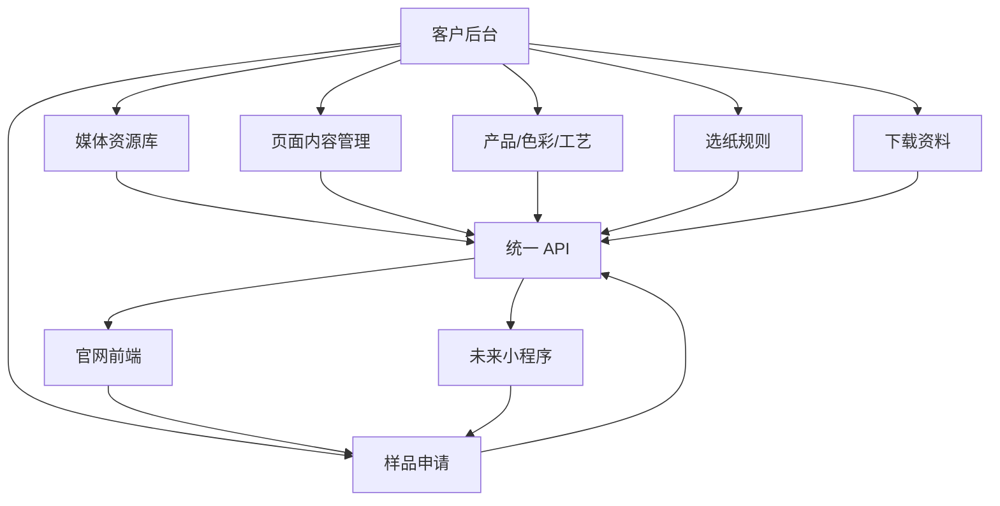

# 齐力纸业 V1.1 后台、数据库、API 字段拆分说明

**创建日期**：2026 年 6 月 7 日
**依据来源**：已上线的 V1.1 前端确认版、客户 V1.1 PDF、现有开发方向记录。
**用途**：把已经上线的前端页面拆成后续后台、数据库和 API 的开发依据。
**当前状态**：用于下一阶段后台/API 开发准备。客户确认优先；如果客户短期未回复，可先开发已知的后台/API 基础能力。

---

## 一、为什么现在要做这份拆分

当前 V1.1 前端已经上线到客户 VPS：

```text
https://qilipaper.com/vanglam
```

前端页面已经能让客户看到官网方向，但这些内容目前仍然写在前端代码里。

后续客户要求是：

```text
文字、图片、视频、资料文件等资源都由客户通过后台上传和维护。
```

因此下一步不能直接随便写后台页面，而要先把前端内容拆清楚：

1. 哪些内容需要后台编辑。
2. 哪些图片需要后台上传。
3. 哪些资料文件需要后台上传。
4. 哪些表单需要后台接收。
5. 哪些数据需要给官网读取。
6. 哪些数据未来需要给小程序读取。
7. 哪些内容中英文都要分别维护。
8. 哪些内容之间有关联关系。

这份文档就是后台开发前的结构依据。

---

## 二、当前前端页面与后台模块关系

| 前端页面 | 当前路由 | 后台对应模块 | 是否第一期建议做 |
| --- | --- | --- | --- |
| 首页 | `/vanglam` | 首页内容管理 | 是 |
| 色彩系统 | `/vanglam/color-system` | 色彩系统管理 | 是 |
| 产品系列 | `/vanglam/collections` | 产品系列管理 | 是 |
| 表面工艺 | `/vanglam/surfaces` | 表面工艺管理 | 是 |
| 应用场景 | `/vanglam/applications` | 应用场景管理 | 是 |
| 酒类与烈酒标签 | `/vanglam/applications/wine-spirits-labels` | 应用场景详情管理 | 是 |
| 标签纸实验室 | `/vanglam/artlabel-lab` | 标签纸实验室管理 | 是 |
| 艺术卡实验室 | `/vanglam/artcard-lab` | 艺术卡实验室管理 | 是 |
| 纸艺工坊 | `/vanglam/atelier` | 工坊与品牌故事管理 | 是 |
| 交付体系 | `/vanglam/atelier/delivery-system` | 交付流程管理 | 是 |
| 样册系统 | `/vanglam/sample-system` | 样册系统管理 | 是 |
| 选纸工具 | `/vanglam/material-selector` | 选纸规则管理 | 是 |
| 下载中心 | `/vanglam/downloads` | 资料下载管理 | 是 |
| 洞察内容 | `/vanglam/insights` | 文章内容管理 | 可第二期 |
| 索取样品套装 | `/vanglam/request-sample-kit` | 样品申请管理 | 是 |

第一期建议目标：

```text
后台能管理官网主要页面、图片、资料文件和样品申请。
```

第二期再扩展：

```text
文章内容、下载统计、客户线索分析、小程序更完整展示。
```

---

## 三、客户未回复时可以先开发的后台/API

客户确认前端页面方向是优先事项，但后台/API 不需要全部等客户逐字确认后才开始。

原因很简单：

1. 客户已经确认后续要有后台。
2. 客户已经确认文字、图片、视频、PDF 等资源后续由他们自己上传。
3. 客户已经确认未来要做小程序，小程序要和这个后台有关联。
4. 现在已经有 V1.1 前端页面，可以作为第一版后台字段依据。

所以如果客户暂时没有回复页面细节，可以先开发不会浪费的基础能力。

### 3.1 可以先做的内容

| 开发内容 | 为什么可以先做 | 后续客户确认后怎么调整 |
| --- | --- | --- |
| 后台登录 | 所有后台都需要登录入口 | 后续只需要补正式账号、权限和密码策略 |
| 管理员与权限 | 后台需要区分管理人员和编辑人员 | 后续按客户实际人员调整角色 |
| 媒体资源库 | 图片、视频、PDF 都需要上传和选择 | 后续客户上传真实素材即可 |
| 导航与页脚 | 官网顶部和底部一定要可维护 | 后续客户确认名称后改文字和排序 |
| 首页内容管理 | 首页是第一优先页面 | 后续客户替换文案、图片、视频、按钮 |
| 首页新品上线 | 客户已提出新品可上传视频 | 后续客户上传真实新品视频和封面 |
| 页面通用模块 | 每个页面都需要标题、说明、图片、按钮 | 后续页面名变动也能复用 |
| 色彩系统基础 CRUD | 色名、色值、色族、排序一定需要 | 后续客户补真实色卡和内部色名 |
| 产品系列基础 CRUD | 产品分类和产品系列一定需要 | 后续客户确认内部产品名称后修改 |
| 表面工艺基础 CRUD | 工艺展示一定需要后台维护 | 后续客户补真实工艺图片和说明 |
| 应用场景基础 CRUD | 场景展示是官网核心内容 | 后续客户增删行业分类即可 |
| 样册系统 | 样册后续要由客户维护 | 后续客户上传真实样册封面和说明 |
| 下载中心 | PDF、检测报告、技术表需要后台上传 | 后续客户决定公开下载还是留资下载 |
| 样品申请 | 官网表单必须能进入后台 | 后续客户确认通知人和字段即可 |
| 公开 API | 官网要读取后台内容 | 后续字段微调，不影响 API 主结构 |
| 小程序字段预留 | 小程序未来复用同一套后台 | 后续做小程序时不需要重建数据结构 |
| 操作日志 | 需要记录后台做过什么 | 后续审计和维护都能用 |

### 3.2 暂时不定死的内容

以下内容先预留结构，不在客户未回复前写死：

1. 最终产品系列名称。
2. 最终工艺标准名称。
3. 选纸工具的最终推荐规则。
4. 真实 PDF 文件和下载权限。
5. 表单通知接收人。
6. 某个页面是否最终删除或合并。
7. 大量真实内容录入。

这里要注意：大量内容录入不是开发方工作，客户后续通过后台自己维护。开发方负责把入口、字段、上传、保存、展示和 API 做好。

---

## 四、后台菜单建议

### 4.1 一级菜单

后台建议分成以下一级菜单：

1. 首页管理
2. 色彩系统
3. 产品系列
4. 表面工艺
5. 应用场景
6. 标签纸实验室
7. 艺术卡实验室
8. 纸艺工坊
9. 交付体系
10. 样册系统
11. 选纸工具
12. 下载中心
13. 样品申请
14. 媒体资源库
15. 导航与页脚
16. 系统设置
17. 操作日志

### 4.2 后台页面原则

客户是非技术用户，所以后台页面要简单：

1. 不要让客户看到数据库字段名。
2. 不要出现复杂英文技术词。
3. 每个页面告诉客户“这里控制官网哪个位置”。
4. 图片上传后要能预览。
5. 中英文文案放在同一个编辑页面里。
6. 每条内容都能设置是否显示。
7. 每条内容都能设置排序。
8. 修改后要有保存提示。
9. 重要删除操作要二次确认。
10. 所有操作写入操作日志。

---

## 五、数据库总览

第一期建议使用 MySQL。

数据库表可以分为 8 类：

1. 管理员与权限
2. 媒体资源
3. 页面内容
4. 产品与材料
5. 选纸工具
6. 样册与下载
7. 表单与客户线索
8. 系统记录

### 5.1 数据表清单

| 表名 | 中文含义 | 用途 |
| --- | --- | --- |
| `admins` | 管理员表 | 后台登录账号 |
| `admin_roles` | 角色表 | 超级管理员、编辑人员等 |
| `admin_audit_logs` | 操作日志表 | 记录后台做了什么 |
| `media_assets` | 媒体资源表 | 图片、视频、PDF、文件 |
| `site_settings` | 网站基础设置表 | 品牌名、联系方式、SEO 默认值 |
| `navigation_items` | 导航表 | 顶部导航、页脚链接 |
| `pages` | 页面表 | 每个官网页面的基础信息 |
| `page_sections` | 页面模块表 | 页面中的 Hero、卡片区、说明区 |
| `home_product_launches` | 首页新品上线表 | 首页新品上线内容，支持封面图和视频 |
| `colors` | 色彩表 | 42 色、品牌三色、色族 |
| `color_families` | 色族表 | 六大色族 |
| `collection_groups` | 产品分组表 | 四层产品体系 |
| `collections` | 产品系列表 | Color Print、Touch、Pearl 等 |
| `surfaces` | 表面工艺表 | 纹路、触感、珠光、压纹等 |
| `applications` | 应用场景表 | 酒标、美妆、手提袋等 |
| `artlabel_items` | 标签纸实验室内容表 | 标签纸客户、纸张、工艺等内容 |
| `artcard_items` | 艺术卡内容表 | 邀请函、贺卡、纸物等 |
| `atelier_items` | 工坊内容表 | 生产、样品、质量、材料哲学 |
| `delivery_steps` | 交付步骤表 | 8 步交付体系 |
| `sample_kits` | 样册表 | Color Deck、Texture Deck 等 |
| `download_assets` | 下载资料表 | PDF、技术表、检测报告 |
| `selector_options` | 选纸选项表 | 应用、表面、工艺选项 |
| `selector_rules` | 选纸规则表 | 根据选择输出推荐结果 |
| `sample_requests` | 样品申请表 | 官网表单提交记录 |
| `contact_leads` | 客户线索表 | 后续可统一收集询盘 |
| `insight_articles` | 洞察文章表 | 选纸指南、工艺知识 |

---

## 六、中英文内容怎么存

第一期建议使用“同一条记录里放中英文”的方式。

例如一个页面标题：

```text
title_zh
title_en
body_zh
body_en
```

这样客户编辑时更直观：

```text
中文标题：标签纸实验室
英文标题：ArtLabel Lab
```

不建议第一期就做复杂翻译表，因为客户目前重点是快速维护官网内容。

后续如果内容量很大，再升级成独立多语言表。

### 6.1 首页新品上线视频模块

客户已经提出：首页如果用于新品上线，希望可以上传视频，并且该视频可以在后台设置。

因此首页管理中需要单独预留：

```text
新品上线模块
```

该模块后台字段建议如下：

| 字段 | 中文说明 | 给客户看的编辑项 |
| --- | --- | --- |
| `title_zh` | 中文标题 | 新品标题中文 |
| `title_en` | 英文标题 | 新品标题英文 |
| `description_zh` | 中文说明 | 新品介绍中文 |
| `description_en` | 英文说明 | 新品介绍英文 |
| `cover_media_asset_id` | 封面图资源 | 上传封面图片 |
| `video_media_asset_id` | 视频资源 | 上传新品视频 |
| `cta_text_zh` | 中文按钮文字 | 按钮文字中文 |
| `cta_text_en` | 英文按钮文字 | 按钮文字英文 |
| `cta_href` | 按钮链接 | 点击后跳转到哪里 |
| `status` | 显示状态 | 是否显示 |
| `sort_order` | 排序 | 排在第几个 |
| `starts_at` | 上线时间 | 什么时间开始显示 |
| `ends_at` | 下线时间 | 什么时间停止显示 |

前台读取方式：

```text
GET /api/public/home
```

该接口同时给官网首页和未来小程序首页使用。

后台上传的视频先进入媒体资源库，再被新品上线模块选择使用。

---

## 七、核心数据表字段

### 7.1 管理员表 `admins`

用途：后台账号登录。

字段建议：

| 字段 | 中文含义 |
| --- | --- |
| `id` | ID |
| `email` | 登录邮箱 |
| `password_hash` | 加密后的密码 |
| `name` | 管理员姓名 |
| `role_id` | 角色 ID |
| `status` | 启用 / 禁用 |
| `last_login_at` | 最后登录时间 |
| `created_at` | 创建时间 |
| `updated_at` | 更新时间 |

说明：

```text
数据库里不保存明文密码，只保存加密后的密码。
```

### 7.2 媒体资源表 `media_assets`

用途：所有图片、视频、PDF、检测报告、样册文件统一上传到媒体资源库。

字段建议：

| 字段 | 中文含义 |
| --- | --- |
| `id` | ID |
| `type` | 文件类型：图片、视频、PDF、文档 |
| `title` | 文件标题 |
| `alt_zh` | 中文图片说明 |
| `alt_en` | 英文图片说明 |
| `file_url` | 文件访问地址 |
| `storage_path` | 服务器存储路径 |
| `mime_type` | 文件格式 |
| `file_size` | 文件大小 |
| `width` | 图片宽度 |
| `height` | 图片高度 |
| `uploaded_by` | 上传人 |
| `created_at` | 上传时间 |

第一期文件存储：

```text
先放 VPS 本地目录。
```

后续可升级：

```text
阿里云 OSS + CDN。
```

### 7.3 页面表 `pages`

用途：管理每个官网页面的基础信息。

字段建议：

| 字段 | 中文含义 |
| --- | --- |
| `id` | ID |
| `slug` | 页面唯一标识 |
| `route` | 前端路由 |
| `title_zh` | 中文页面标题 |
| `title_en` | 英文页面标题 |
| `eyebrow_zh` | 中文小标题 |
| `eyebrow_en` | 英文小标题 |
| `body_zh` | 中文页面说明 |
| `body_en` | 英文页面说明 |
| `hero_image_id` | 头图资源 ID |
| `seo_title_zh` | 中文 SEO 标题 |
| `seo_title_en` | 英文 SEO 标题 |
| `seo_description_zh` | 中文 SEO 描述 |
| `seo_description_en` | 英文 SEO 描述 |
| `is_visible` | 是否显示 |
| `sort_order` | 排序 |
| `updated_at` | 更新时间 |

页面示例：

```text
home
color-system
collections
surfaces
applications
artlabel-lab
artcard-lab
atelier
delivery-system
sample-system
material-selector
downloads
insights
request-sample-kit
```

### 7.4 页面模块表 `page_sections`

用途：管理一个页面里的多个模块。

例如首页可以分成：

1. Hero
2. 三款标志色
3. 色彩系统
4. 产品系列
5. 表面工艺
6. 应用场景
7. V1.1 新模块入口
8. 纸艺工坊

字段建议：

| 字段 | 中文含义 |
| --- | --- |
| `id` | ID |
| `page_id` | 所属页面 |
| `section_key` | 模块标识 |
| `layout_type` | 模块样式类型 |
| `title_zh` | 中文标题 |
| `title_en` | 英文标题 |
| `body_zh` | 中文说明 |
| `body_en` | 英文说明 |
| `image_id` | 图片资源 ID |
| `button_text_zh` | 中文按钮 |
| `button_text_en` | 英文按钮 |
| `button_link` | 按钮链接 |
| `is_visible` | 是否显示 |
| `sort_order` | 排序 |

---

## 八、产品、色彩、工艺相关表

### 8.1 色族表 `color_families`

字段：

| 字段 | 中文含义 |
| --- | --- |
| `id` | ID |
| `slug` | 色族标识 |
| `name_zh` | 中文名 |
| `name_en` | 英文名 |
| `description_zh` | 中文说明 |
| `description_en` | 英文说明 |
| `theme_color` | 代表色 |
| `sort_order` | 排序 |
| `is_visible` | 是否显示 |

### 8.2 色彩表 `colors`

字段：

| 字段 | 中文含义 |
| --- | --- |
| `id` | ID |
| `family_id` | 所属色族 |
| `code` | 色号，例如 D06 |
| `name_zh` | 中文名 |
| `name_en` | 英文名 |
| `hex` | 数字参考色值 |
| `role` | 标志色 / 普通色 |
| `emotion_zh` | 中文情绪描述 |
| `emotion_en` | 英文情绪描述 |
| `sort_order` | 排序 |
| `is_visible` | 是否显示 |

重要说明：

```text
色值只作为数字参考，最终颜色以实物纸样和仪器确认为准。
```

### 8.3 产品分组表 `collection_groups`

对应当前四层体系：

1. Commercial Essentials / 商业基础系列
2. Performance Papers / 性能应用纸
3. Signature Materials / 高级材料体系
4. Bespoke & Labs / 专项定制与实验室

字段：

| 字段 | 中文含义 |
| --- | --- |
| `id` | ID |
| `slug` | 分组标识 |
| `name_zh` | 中文名 |
| `name_en` | 英文名 |
| `description_zh` | 中文说明 |
| `description_en` | 英文说明 |
| `sort_order` | 排序 |
| `is_visible` | 是否显示 |

### 8.4 产品系列表 `collections`

字段：

| 字段 | 中文含义 |
| --- | --- |
| `id` | ID |
| `group_id` | 所属四层分组 |
| `slug` | 产品标识 |
| `name_zh` | 中文名 |
| `name_en` | 英文名 |
| `summary_zh` | 中文短说明 |
| `summary_en` | 英文短说明 |
| `description_zh` | 中文详细说明 |
| `description_en` | 英文详细说明 |
| `gsm_range` | 克重范围 |
| `image_id` | 图片 |
| `sort_order` | 排序 |
| `is_visible` | 是否显示 |

### 8.5 表面工艺表 `surfaces`

字段：

| 字段 | 中文含义 |
| --- | --- |
| `id` | ID |
| `slug` | 工艺标识 |
| `category` | 工艺分类 |
| `name_zh` | 中文名 |
| `name_en` | 英文名 |
| `description_zh` | 中文说明 |
| `description_en` | 英文说明 |
| `image_id` | 图片 |
| `sort_order` | 排序 |
| `is_visible` | 是否显示 |

工艺分类建议：

```text
Texture
Coating
Tactility
Pearl
Embossing
Foil / UV
Functional
```

### 8.6 应用场景表 `applications`

字段：

| 字段 | 中文含义 |
| --- | --- |
| `id` | ID |
| `slug` | 应用标识 |
| `name_zh` | 中文名 |
| `name_en` | 英文名 |
| `summary_zh` | 中文短说明 |
| `summary_en` | 英文短说明 |
| `description_zh` | 中文详细说明 |
| `description_en` | 英文详细说明 |
| `image_id` | 图片 |
| `sort_order` | 排序 |
| `is_visible` | 是否显示 |

应用场景可以关联：

1. 推荐产品系列
2. 推荐表面工艺
3. 推荐色彩
4. 推荐样册

---

## 九、V1.1 新模块字段

### 9.1 标签纸实验室 `artlabel_items`

用途：维护 ArtLabel Lab 页面内容。

字段：

| 字段 | 中文含义 |
| --- | --- |
| `id` | ID |
| `type` | 内容类型：客户类型、推荐纸张、适配工艺 |
| `title_zh` | 中文标题 |
| `title_en` | 英文标题 |
| `body_zh` | 中文说明 |
| `body_en` | 英文说明 |
| `image_id` | 图片 |
| `sort_order` | 排序 |
| `is_visible` | 是否显示 |

当前前端类型：

```text
客户类型
推荐纸张方向
适配工艺
```

### 9.2 交付步骤 `delivery_steps`

用途：维护 8 步标准化交付体系。

字段：

| 字段 | 中文含义 |
| --- | --- |
| `id` | ID |
| `step_no` | 步骤编号 |
| `title_zh` | 中文标题 |
| `title_en` | 英文标题 |
| `body_zh` | 中文说明 |
| `body_en` | 英文说明 |
| `icon` | 图标 |
| `sort_order` | 排序 |
| `is_visible` | 是否显示 |

当前 8 步：

1. 客户需求转译体系
2. 项目可行性评审体系
3. 标准样建立体系
4. 生产计划与交期控制体系
5. 原料批次与参数控制体系
6. 标准化生产执行体系
7. 品质检测与放行体系
8. 包装防护与批次追溯体系

### 9.3 样册系统 `sample_kits`

用途：维护样册和样品套装类型。

字段：

| 字段 | 中文含义 |
| --- | --- |
| `id` | ID |
| `slug` | 样册标识 |
| `name_zh` | 中文名 |
| `name_en` | 英文名 |
| `description_zh` | 中文说明 |
| `description_en` | 英文说明 |
| `image_id` | 图片 |
| `related_download_id` | 关联下载资料 |
| `sort_order` | 排序 |
| `is_visible` | 是否显示 |

当前样册：

1. Color Deck
2. Texture Deck
3. Coating Book
4. Surface Lab
5. Weight Deck
6. Application Library
7. Artcard Lab Edition

### 9.4 下载资料 `download_assets`

用途：维护 Download Center 的文件资料。

字段：

| 字段 | 中文含义 |
| --- | --- |
| `id` | ID |
| `title_zh` | 中文标题 |
| `title_en` | 英文标题 |
| `type` | 文件类型 |
| `description_zh` | 中文说明 |
| `description_en` | 英文说明 |
| `file_asset_id` | 文件资源 ID |
| `cover_image_id` | 封面图 |
| `is_gated` | 是否需要填写联系方式 |
| `is_visible` | 是否显示 |
| `sort_order` | 排序 |
| `download_count` | 下载次数 |
| `created_at` | 创建时间 |
| `updated_at` | 更新时间 |

第一期可以先实现：

```text
上传文件
编辑标题说明
设置公开下载 / 需要填写联系方式
设置排序和显示状态
```

下载统计可以第二期完善。

### 9.5 洞察文章 `insight_articles`

用途：维护 Insights 内容。

字段：

| 字段 | 中文含义 |
| --- | --- |
| `id` | ID |
| `slug` | 文章地址 |
| `title_zh` | 中文标题 |
| `title_en` | 英文标题 |
| `excerpt_zh` | 中文摘要 |
| `excerpt_en` | 英文摘要 |
| `content_zh` | 中文正文 |
| `content_en` | 英文正文 |
| `cover_image_id` | 封面图 |
| `status` | 草稿 / 显示 / 隐藏 |
| `published_at` | 发布时间 |
| `sort_order` | 排序 |

注意：

```text
如果客户现在不做文章，第一期可以只预留入口。
```

---

## 十、选纸工具数据结构

选纸工具是 V1.1 的重点。

第一期建议做轻量规则，不做复杂算法。

### 10.1 选纸选项表 `selector_options`

字段：

| 字段 | 中文含义 |
| --- | --- |
| `id` | ID |
| `type` | 选项类型：应用、表面、工艺 |
| `value` | 选项值 |
| `label_zh` | 中文标签 |
| `label_en` | 英文标签 |
| `sort_order` | 排序 |
| `is_visible` | 是否显示 |

当前选项类型：

```text
application  应用场景
surface      表面方向
process      印刷/后道工艺
```

### 10.2 选纸规则表 `selector_rules`

字段：

| 字段 | 中文含义 |
| --- | --- |
| `id` | ID |
| `application_option_id` | 应用选项 |
| `surface_option_id` | 表面选项 |
| `process_option_id` | 工艺选项 |
| `recommended_collection_zh` | 推荐产品系列中文 |
| `recommended_collection_en` | 推荐产品系列英文 |
| `recommended_color_zh` | 推荐色彩中文 |
| `recommended_color_en` | 推荐色彩英文 |
| `recommended_surface_zh` | 推荐表面工艺中文 |
| `recommended_surface_en` | 推荐表面工艺英文 |
| `recommended_weight_zh` | 推荐克重中文 |
| `recommended_weight_en` | 推荐克重英文 |
| `recommended_sample_zh` | 推荐样册中文 |
| `recommended_sample_en` | 推荐样册英文 |
| `is_visible` | 是否启用 |

第一版规则可以简单理解为：

```text
客户选了“酒类标签 + 珠光 + 烫金”
后台返回“推荐产品系列、推荐颜色、推荐工艺、推荐克重、推荐样册”
```

这样就能让官网和未来小程序都调用同一套推荐规则。

---

## 十一、样品申请与客户线索

### 11.1 样品申请表 `sample_requests`

用途：接收官网 `Request Sample Kit / 索取样品套装` 表单。

字段：

| 字段 | 中文含义 |
| --- | --- |
| `id` | ID |
| `name` | 姓名 |
| `company` | 公司 |
| `country` | 国家/地区 |
| `email` | 邮箱 |
| `website` | 网站 |
| `industry` | 行业 |
| `application` | 应用场景 |
| `interested_products` | 感兴趣产品 |
| `printing_method` | 印刷方式 |
| `finishing_process` | 后道工艺 |
| `expected_quantity` | 预计数量 |
| `message` | 项目说明 |
| `source_page` | 来源页面 |
| `language` | 提交语言 |
| `status` | 新提交 / 已联系 / 已完成 / 已关闭 |
| `assigned_to` | 负责人 |
| `admin_note` | 后台备注 |
| `created_at` | 提交时间 |
| `updated_at` | 更新时间 |

### 11.2 后续通知

第一期可以先做：

```text
后台列表查看
后台备注
状态更新
```

后续再做：

```text
邮件通知
企业微信通知
客户线索统计
```

---

## 十二、API 设计

API 要同时服务：

1. 官网前端。
2. 后台管理。
3. 未来小程序。

### 12.1 官网公开 API

公开 API 只返回前台需要展示的数据。

| API | 用途 |
| --- | --- |
| `GET /api/public/site-settings` | 网站基础设置 |
| `GET /api/public/navigation` | 导航与页脚 |
| `GET /api/public/pages/:slug` | 页面基础内容 |
| `GET /api/public/home` | 首页完整内容 |
| `GET /api/public/colors` | 色彩系统 |
| `GET /api/public/collections` | 产品系列 |
| `GET /api/public/surfaces` | 表面工艺 |
| `GET /api/public/applications` | 应用场景 |
| `GET /api/public/artlabel-lab` | 标签纸实验室 |
| `GET /api/public/artcard-lab` | 艺术卡实验室 |
| `GET /api/public/atelier` | 纸艺工坊 |
| `GET /api/public/delivery-system` | 交付体系 |
| `GET /api/public/sample-system` | 样册系统 |
| `GET /api/public/downloads` | 下载中心 |
| `GET /api/public/insights` | 洞察内容 |
| `POST /api/public/sample-requests` | 提交样品申请 |
| `POST /api/public/material-selector/recommend` | 选纸工具推荐 |

### 12.2 后台管理 API

后台 API 需要登录后才能访问。

| API | 用途 |
| --- | --- |
| `POST /api/admin/auth/login` | 后台登录 |
| `POST /api/admin/auth/logout` | 退出登录 |
| `GET /api/admin/me` | 当前管理员 |
| `GET /api/admin/media` | 媒体资源列表 |
| `POST /api/admin/media` | 上传媒体资源 |
| `GET /api/admin/pages` | 页面列表 |
| `PUT /api/admin/pages/:id` | 更新页面 |
| `GET /api/admin/collections` | 产品列表 |
| `POST /api/admin/collections` | 新建产品 |
| `PUT /api/admin/collections/:id` | 更新产品 |
| `GET /api/admin/selector-rules` | 选纸规则列表 |
| `POST /api/admin/selector-rules` | 新建选纸规则 |
| `PUT /api/admin/selector-rules/:id` | 更新选纸规则 |
| `GET /api/admin/download-assets` | 下载资料列表 |
| `POST /api/admin/download-assets` | 新建下载资料 |
| `PUT /api/admin/download-assets/:id` | 更新下载资料 |
| `GET /api/admin/sample-requests` | 样品申请列表 |
| `PUT /api/admin/sample-requests/:id` | 更新样品申请状态和备注 |
| `GET /api/admin/audit-logs` | 操作日志 |

### 12.3 小程序 API 预留

小程序暂不开发，但 API 设计要预留。

建议小程序复用公开 API，并增加：

| API | 用途 |
| --- | --- |
| `GET /api/public/miniprogram/home` | 小程序首页精简内容 |
| `GET /api/public/miniprogram/material-selector` | 小程序选纸工具配置 |
| `POST /api/public/miniprogram/sample-requests` | 小程序提交样品申请 |

数据库字段中需要预留：

```text
show_in_miniprogram
miniprogram_title_zh
miniprogram_title_en
miniprogram_summary_zh
miniprogram_summary_en
miniprogram_image_id
miniprogram_sort_order
```

---

## 十三、后台与官网、小程序的数据关系



简单解释：

1. 客户在后台上传图片、文件、文字。
2. 数据存入数据库和媒体资源库。
3. 官网通过 API 读取。
4. 小程序未来也通过同一套 API 读取。
5. 官网和小程序提交的样品申请，都进入同一个后台列表。

---

## 十四、第一期开发顺序建议

### 阶段一：后台地基

1. 新建独立项目。
2. 建立数据库连接。
3. 建立管理员登录。
4. 建立操作日志。
5. 建立媒体资源上传。

### 阶段二：官网内容闭环

1. 后台编辑一个首页模块。
2. 保存到数据库。
3. 官网 API 读取。
4. 官网显示更新内容。
5. 操作日志记录。

这是整个后台最重要的闭环。

### 阶段三：V1.1 页面管理

1. 首页管理。
2. 色彩系统。
3. 产品系列。
4. 表面工艺。
5. 应用场景。
6. 标签纸实验室。
7. 艺术卡实验室。
8. 纸艺工坊。
9. 交付体系。
10. 样册系统。
11. 下载中心。
12. 选纸工具。

### 阶段四：表单与线索

1. 样品申请提交。
2. 后台查看样品申请。
3. 后台修改处理状态。
4. 后台添加备注。

### 阶段五：小程序预留

1. API 字段预留。
2. 数据库字段预留。
3. 小程序显示开关预留。
4. 小程序排序预留。

---

## 十五、当前结论

当前前端已经形成后台开发依据。

下一步正式开发时，应先建立：

```text
管理员登录
数据库连接
媒体资源库
页面内容管理
API 输出
操作日志
```

不要一开始就把所有页面全部写完。

最优先要跑通的是：

```text
后台修改一条内容 → 数据库保存 → API 返回 → 官网显示变化
```

这个闭环跑通后，再逐步补齐所有页面和小程序接口。
