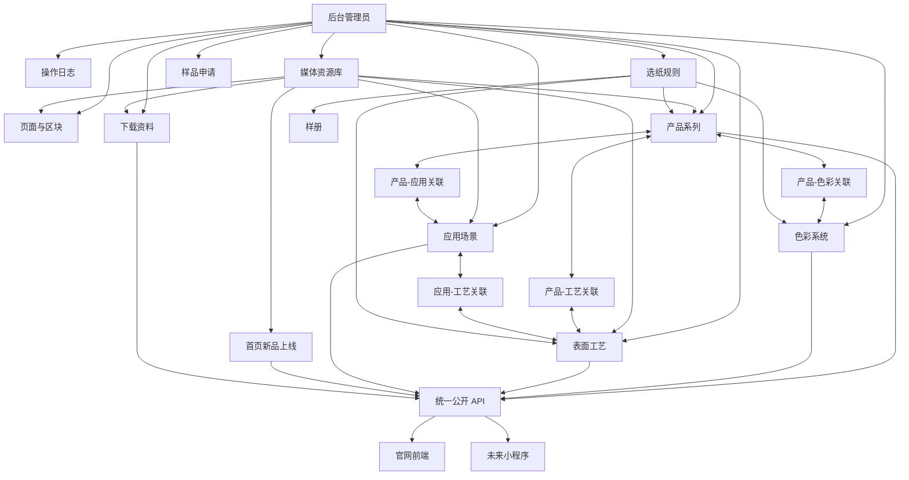

# 齐力纸业数据库健壮性设计说明

**创建日期**：2026 年 6 月 7 日
**用途**：作为齐力纸业后台、官网 API、未来小程序共用数据结构的设计依据。
**当前状态**：用于指导后续 Prisma/MySQL schema 强化，不是客户录入内容清单。

---

## 一、设计目标

齐力纸业官网不是普通展示页，里面有很多互相关联的内容：

1. 产品系列会关联色彩。
2. 产品系列会关联表面工艺。
3. 产品系列会关联应用场景。
4. 应用场景会推荐产品系列。
5. 应用场景会推荐表面工艺。
6. 选纸工具会根据应用、表面、工艺输出推荐结果。
7. 首页新品上线会关联图片、视频、产品或跳转链接。
8. 下载中心会关联 PDF、样册、检测报告。
9. 样品申请会关联客户感兴趣的产品、工艺、应用场景。
10. 官网和未来小程序要共用同一套 API 和数据库。

所以数据库不能只做成“页面标题 + 页面文字 + 图片链接”的简单结构。

第一期数据库要做到：

1. 客户能在后台维护文字、图片、视频、PDF。
2. 官网能读取同一套数据。
3. 小程序未来也能读取同一套数据。
4. 产品、色彩、工艺、应用之间的关系能长期维护。
5. 后续新增页面或小程序展示时，不需要推翻数据库。
6. 删除、下架、隐藏内容时，不破坏已有关系。
7. 后台操作能留下记录，方便审计。

---

## 二、核心设计原则

### 2.1 业务内容不要全部塞进页面表

页面表只负责页面结构，例如：

```text
首页
色彩系统页
产品系列页
表面工艺页
应用场景页
下载中心页
```

真正的业务内容要单独建表，例如：

```text
产品系列
色彩
表面工艺
应用场景
样册
下载资料
选纸规则
```

这样后台以后既能改页面，也能管理产品资料。

### 2.2 关联关系必须用 ID，不用文字硬写

不要这样做：

```text
推荐产品：Pearl, Touch, Texture
推荐工艺：Embossed, Soft Touch
```

这种写法后续会出现：

1. 中英文不一致。
2. 产品改名后旧内容失效。
3. 小程序无法稳定读取。
4. 选纸规则无法准确匹配。

应该这样做：

```text
应用场景 -> application_collections -> 产品系列
应用场景 -> application_surfaces -> 表面工艺
产品系列 -> collection_colors -> 色彩
产品系列 -> collection_surfaces -> 表面工艺
```

### 2.3 图片、视频、PDF 全部进入媒体资源库

所有文件统一存在：

```text
media_assets
```

其他表只保存媒体 ID。

这样做的好处：

1. 同一张图可以多处复用。
2. 后续可以替换文件但保留业务关系。
3. 可以记录文件类型、大小、尺寸、时长。
4. 可以给官网、小程序分别返回适合的资源。
5. 后续接阿里云 OSS 或 CDN 更方便。

### 2.4 官网和小程序共用数据，但展示开关分开

同一条内容要预留：

```text
showOnWebsite
showOnMiniProgram
websiteSortOrder
miniProgramSortOrder
miniProgramTitleZh
miniProgramTitleEn
miniProgramSummaryZh
miniProgramSummaryEn
miniProgramCoverMediaAssetId
```

这样客户只维护一套内容，但可以控制：

1. 官网显示哪些。
2. 小程序显示哪些。
3. 官网排序。
4. 小程序排序。
5. 小程序用更短的标题和简介。

### 2.5 删除优先用隐藏和归档，不直接物理删除

后台第一期建议提供：

```text
草稿
显示
隐藏
归档
```

数据库里用 `status` 管理。

客户在后台点“删除”时，实际建议做归档，不直接删除数据库记录。

原因：

1. 避免产品被应用场景引用后突然消失。
2. 避免选纸规则引用失效。
3. 避免历史样品申请失去上下文。
4. 方便后续恢复。

---

## 三、推荐数据关系总图



---

## 四、第一期建议数据表分层

### 4.1 系统与权限层

| 表 | 用途 |
| --- | --- |
| `admins` | 后台管理员 |
| `admin_roles` | 管理员角色 |
| `admin_sessions` | 登录会话 |
| `admin_audit_logs` | 后台操作日志 |

关键要求：

1. 密码只保存加密后的 `passwordHash`。
2. 登录会话要有过期时间。
3. 每次新增、修改、隐藏、归档都写操作日志。
4. 操作日志记录管理员、动作、对象、时间、IP、浏览器信息。

### 4.2 媒体资源层

| 表 | 用途 |
| --- | --- |
| `media_assets` | 图片、视频、PDF、文件统一资源库 |
| `media_folders` | 资源分组，可选 |

`media_assets` 建议字段：

| 字段 | 说明 |
| --- | --- |
| `id` | 资源 ID |
| `kind` | image / video / pdf / document / archive |
| `storageProvider` | local / oss / cdn |
| `bucket` | 存储桶 |
| `objectKey` | 存储路径 |
| `url` | 访问地址 |
| `originalName` | 原文件名 |
| `mimeType` | 文件类型 |
| `sizeBytes` | 文件大小 |
| `width` | 图片或视频宽 |
| `height` | 图片或视频高 |
| `durationSeconds` | 视频时长 |
| `altZh` | 中文替代说明 |
| `altEn` | 英文替代说明 |
| `createdById` | 上传人 |

约束建议：

1. `kind` 必填。
2. `url` 必填。
3. `objectKey` 后续接 OSS 时唯一。
4. 视频才填写 `durationSeconds`。
5. 图片和视频建议填写宽高。

### 4.3 页面内容层

| 表 | 用途 |
| --- | --- |
| `pages` | 页面基础信息 |
| `page_sections` | 页面区块 |
| `page_section_media` | 页面区块和媒体资源多对多关系 |

页面适合管理：

1. 首页 Hero。
2. 页面介绍文字。
3. CTA 按钮。
4. 可排序的介绍模块。

不适合把所有产品、色彩、工艺都塞进页面区块。

### 4.4 产品与材料层

| 表 | 用途 |
| --- | --- |
| `collection_groups` | 产品四层分组 |
| `collections` | 产品系列 |
| `color_families` | 色彩家族 |
| `colors` | 色彩 |
| `surfaces` | 表面工艺 |
| `applications` | 应用场景 |

需要新增的关联表：

| 表 | 关系 |
| --- | --- |
| `collection_colors` | 产品系列关联色彩 |
| `collection_surfaces` | 产品系列关联表面工艺 |
| `collection_applications` | 产品系列关联应用场景 |
| `application_collections` | 应用场景推荐产品系列 |
| `application_surfaces` | 应用场景推荐表面工艺 |
| `application_colors` | 应用场景推荐色彩 |

这些关联表要有：

```text
id
左侧对象 ID
右侧对象 ID
sortOrder
isPrimary
createdAt
updatedAt
```

其中 `isPrimary` 用来标记“主推荐”。

### 4.5 首页新品上线层

| 表 | 用途 |
| --- | --- |
| `home_product_launches` | 首页新品上线 |

建议强化字段：

| 字段 | 说明 |
| --- | --- |
| `titleZh` | 中文标题 |
| `titleEn` | 英文标题 |
| `descriptionZh` | 中文说明 |
| `descriptionEn` | 英文说明 |
| `coverMediaAssetId` | 封面图 |
| `videoMediaAssetId` | 视频 |
| `relatedCollectionId` | 关联产品系列，可选 |
| `ctaHref` | 跳转链接 |
| `status` | 草稿 / 显示 / 隐藏 / 归档 |
| `startsAt` | 上线时间 |
| `endsAt` | 下线时间 |
| `showOnWebsite` | 是否官网显示 |
| `showOnMiniProgram` | 是否小程序显示 |

### 4.6 选纸工具层

| 表 | 用途 |
| --- | --- |
| `selector_options` | 选纸选项 |
| `selector_rules` | 选纸规则 |

需要新增的关联表：

| 表 | 关系 |
| --- | --- |
| `selector_rule_options` | 一条规则关联多个选项 |
| `selector_rule_collections` | 一条规则推荐多个产品系列 |
| `selector_rule_surfaces` | 一条规则推荐多个表面工艺 |
| `selector_rule_colors` | 一条规则推荐多个色彩 |
| `selector_rule_sample_kits` | 一条规则推荐多个样册 |

这样选纸工具不会只返回一段写死文字，而是可以返回真实产品、真实色彩、真实工艺和真实样册。

### 4.7 样册、下载与客户线索层

| 表 | 用途 |
| --- | --- |
| `sample_kits` | 样册 |
| `download_assets` | 下载资料 |
| `sample_requests` | 样品申请 |
| `contact_leads` | 客户线索 |

建议新增关联：

| 表 | 关系 |
| --- | --- |
| `sample_kit_collections` | 样册包含哪些产品系列 |
| `sample_kit_surfaces` | 样册包含哪些表面工艺 |
| `download_asset_collections` | 下载资料关联产品系列 |
| `download_asset_applications` | 下载资料关联应用场景 |
| `sample_request_collections` | 客户样品申请感兴趣产品 |
| `sample_request_applications` | 客户样品申请应用场景 |

---

## 五、删除和归档规则

### 5.1 可以级联删除的关系

以下是纯关系表，可以随主记录删除：

```text
collection_colors
collection_surfaces
collection_applications
application_collections
application_surfaces
application_colors
selector_rule_options
selector_rule_collections
selector_rule_surfaces
selector_rule_colors
selector_rule_sample_kits
page_section_media
```

### 5.2 不建议直接删除的业务主表

以下表不建议后台直接物理删除：

```text
collections
colors
surfaces
applications
sample_kits
download_assets
home_product_launches
sample_requests
contact_leads
media_assets
```

后台删除时建议改为：

```text
status = archived
```

### 5.3 媒体资源删除规则

媒体资源如果已经被任何内容引用，不允许直接删除。

后台可以提供：

1. 查看哪些地方正在使用该资源。
2. 替换资源。
3. 归档资源。
4. 确认无引用后再物理删除文件。

---

## 六、索引和唯一约束建议

### 6.1 Slug 唯一

以下表建议有唯一 `slug`：

```text
pages
collections
surfaces
applications
sample_kits
download_assets
```

用途：

1. 官网路由稳定。
2. 小程序读取稳定。
3. API 不依赖中文标题。

### 6.2 排序索引

经常列表展示的表都要有：

```text
status
showOnWebsite
showOnMiniProgram
websiteSortOrder
miniProgramSortOrder
```

常用索引：

```text
@@index([status, showOnWebsite, websiteSortOrder])
@@index([status, showOnMiniProgram, miniProgramSortOrder])
```

### 6.3 关联表唯一约束

关联表要避免重复关联。

例如：

```text
@@unique([collectionId, colorId])
@@unique([collectionId, surfaceId])
@@unique([applicationId, collectionId])
@@unique([selectorRuleId, collectionId])
```

---

## 七、API 数据读取原则

官网和小程序共用同一套数据库，但 API 可以按场景返回不同字段。

### 7.1 官网 API

官网 API 返回更完整的数据：

```text
标题
说明
图片
视频
按钮
产品详情
推荐关系
SEO 信息
```

### 7.2 小程序 API

小程序 API 可以返回更轻的数据：

```text
短标题
短说明
封面图
排序
跳转目标
推荐产品 ID
推荐样册 ID
```

但底层仍然来自同一套表。

### 7.3 后台 API

后台 API 返回编辑所需的完整结构：

```text
当前内容
关联选项
媒体资源
状态
排序
操作记录
```

---

## 八、后续 Prisma Schema 强化顺序

建议分 5 步做，不一次性把所有复杂表写满。

### 第一步：补通用显示字段

给主要业务表增加：

```text
slug
showOnWebsite
showOnMiniProgram
websiteSortOrder
miniProgramSortOrder
miniProgramTitleZh
miniProgramTitleEn
miniProgramSummaryZh
miniProgramSummaryEn
```

### 第二步：补媒体资源关联

新增：

```text
page_section_media
```

并让 `HomeProductLaunch`、`Collection`、`Surface`、`Application`、`SampleKit`、`DownloadAsset` 明确关联 `MediaAsset`。

### 第三步：补产品、色彩、工艺、应用关联

新增：

```text
collection_colors
collection_surfaces
collection_applications
application_collections
application_surfaces
application_colors
```

### 第四步：补选纸工具关联

新增：

```text
selector_rule_options
selector_rule_collections
selector_rule_surfaces
selector_rule_colors
selector_rule_sample_kits
```

### 第五步：补样册、下载、客户线索关联

新增：

```text
sample_kit_collections
download_asset_collections
sample_request_collections
sample_request_applications
contact_leads
```

---

## 九、验收标准

数据库设计强化后，至少要能证明：

1. 产品系列可以关联多个色彩。
2. 产品系列可以关联多个表面工艺。
3. 产品系列可以关联多个应用场景。
4. 应用场景可以推荐多个产品系列。
5. 应用场景可以推荐多个表面工艺。
6. 选纸规则可以推荐真实产品、色彩、工艺、样册。
7. 首页新品上线可以关联封面图、视频和产品。
8. 媒体资源可以被多个模块复用。
9. 官网和小程序可以用不同显示开关和排序。
10. 后台删除内容时不会破坏历史申请和已有关系。

---

## 十、当前结论

当前第一版 schema 已经能支撑 API 地基，但还不是最终稳固版。

后续进入真实后台和 MySQL 前，必须先按本设计强化数据库关系。

最重要的一点：

```text
所有有关联的业务内容，都用关系表和 ID 连接，不用文字硬写。
```

这样后续官网、后台、小程序才不会越做越乱。
